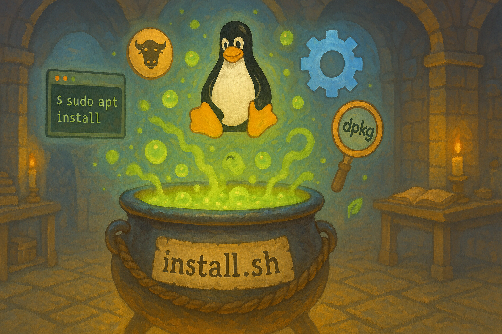

# Linux Install Script



A comprehensive Linux installation script that sets up your system with essential tools and configurations.

## Quick Install

```bash
curl -s https://raw.githubusercontent.com/yourusername/linuxinstall/main/install.sh | bash
```

## Interactive Installation

For an interactive installation with prompts and options:

```bash
curl -s https://raw.githubusercontent.com/yourusername/linuxinstall/main/install.sh | bash -s -- --interactive
```

## Non-Interactive Installation

For a silent installation with default options:

```bash
curl -s https://raw.githubusercontent.com/yourusername/linuxinstall/main/install.sh | bash -s -- --non-interactive
```

## Options

- `--interactive`: Run in interactive mode with prompts (default)
- `--non-interactive`: Run in silent mode with default options
- `--dry-run`: Show what would be installed without making changes
- `--help`: Show help message

## Features

- System package installation
- Development tools setup
- Configuration management
- And more...

## Development

This project uses GitHub Actions for continuous integration, which includes:
- Shell script linting (ShellCheck)
- Spell checking
- Installation script validation

## License

MIT License - See LICENSE file for details
